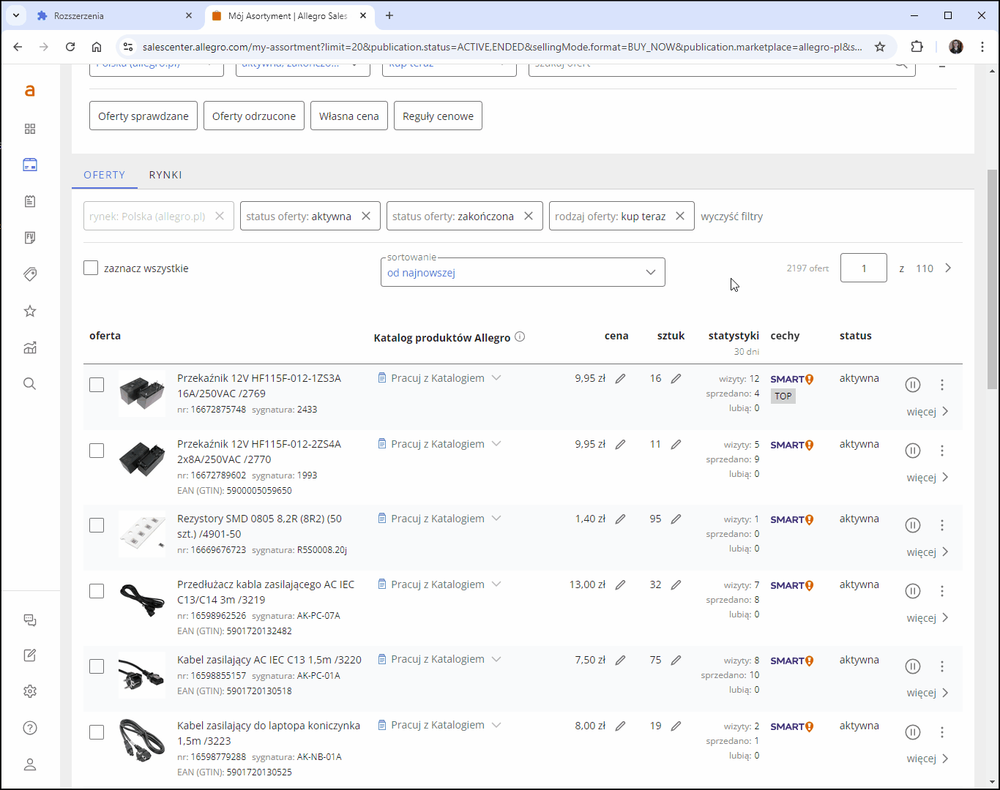
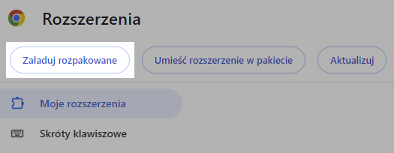
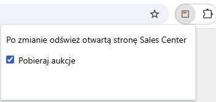
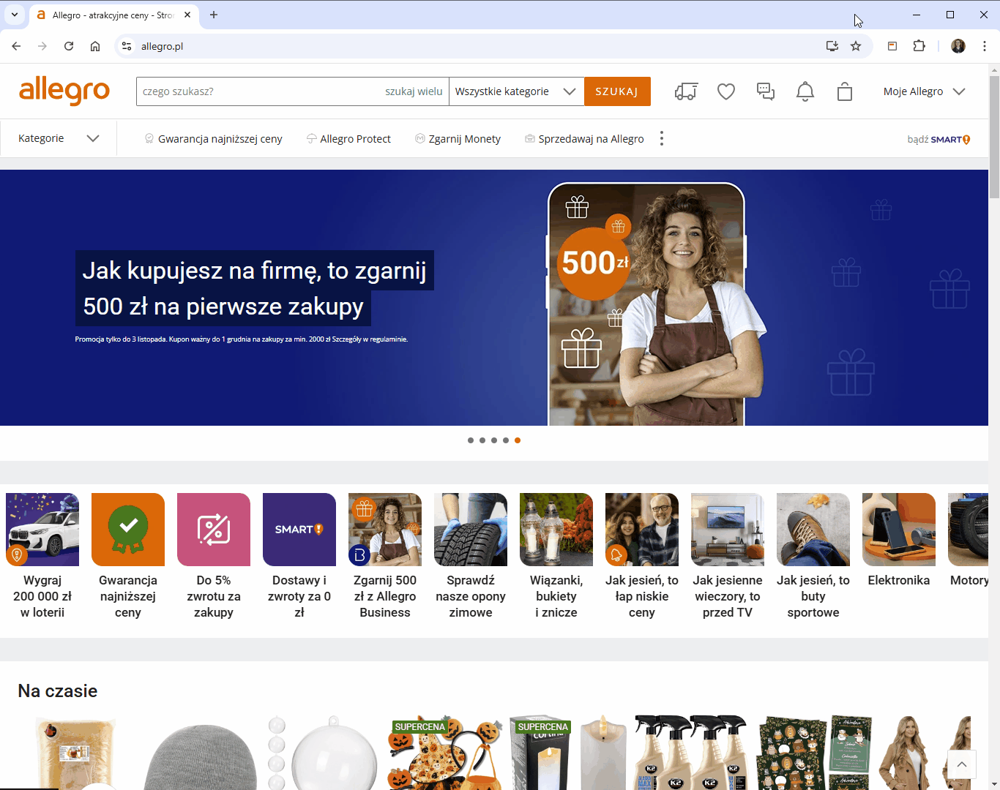
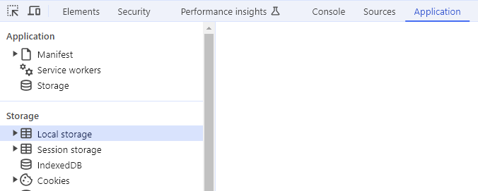
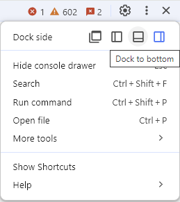

## Pokazuj Top Oferty
To rozszerzenie pozwala na wyświetlanie informacji o tym czy dana aukcja jest Top Ofertą na stronie "Mój asortyment" w Sales Center. 

Jest to rozszerzenie do przeglądarki Chrome. Wszystkie rozszerzenia testuję tylko dla systemu Windows 10 i najnowszej wersji przeglądarki.

**Instrukcja instalacji:**
1. Pobierz rozszerzenie "show_top_offers.zip" z listy plików widocznej powyżej i rozpakuj je tam gdzie zamierzasz je trzymać.
2. Kliknij ikonę menu rozszerzeń w prawym górnym rogu okna przeglądarki (ikona puzzla)  lub z menu przeglądarki wybierz "Rozszerzenia - Zarządzaj rozszerzeniami".
3. Włącz "Tryb dewelopera" w prawym górnym rogu okna przeglądarki 
4. Kliknij przycisk "Załaduj rozpakowane"  

5. Wybierz folder z uprzednio pobranym i rozpakowanym rozszerzeniem.  
6. Jeżeli miałeś otwartą stronę "Sales Center", odśwież ją celem załadowania rozszerzenia.

To wszystko. Rozszerzenie będzie pobierać aukcje widoczne aktualnie na ekranie (plus kilka następnych) i sprawdzać czy są Top Ofertą. Najpierw w kolumnie "cechy" zostanie dodana szara odznaka "TOP" informująca o tym że aukcja będzie sprawdzana. Po sprawdzeniu, jeżeli aukcja jest Top Ofertą, kolor odznaki zmieni się na pomarańczowy, jeżeli nie - treść odznaki zmieni się na "NOR" (od "normalna"). Status danej aukcji zostanie zapamiętany w pamięci tymczasowej przeglądarki do momentu zamknięcia przeglądarki (nie samej karty) lub przeładowania rozszerzenia na karcie rozszerzeń. W pierwszej kolejności strona sprawdza czy status był już pobrany - jeżeli tak, to przy ponownym wczytaniu danej strony na liście aukcji zostanie zaprezentowany ten właśnie status.

Tryb działania nie jest w pełni automatyczny z kilku powodów - po pierwsze, zawartość strony "Mój asortyment" ładowana jest dynamicznie (po przescrollowaniu strony zawartość która jest poza ekranem znika w kodzie strony, jednocześnie dla zachowania płynności przewijania ładowanych jest kilka jeszcze nie widocznych na ekranie aukcji). API Allegro nie umożliwia pobrania ID produktu przypisanego do aukcji ani sprawdzania czy aukcja jest Top Ofertą - jest to wykonywane więc z jego pominięciem poprzez wczytywanie każdej aukcji tak, jakbyś wczytywał ją otwierając jej stronę, ale tylko do pewnego momentu, pozwalającego stwierdzić czy aukcja jest Top Ofertą, nie ma potrzeby wczytywania całej strony, oszczędza to zarówno czas jak i transfer.

Niestety z próbą automatyzacji wiąże się też druga rzecz - Allegro zabezpiecza się przed nadmiernym, zautomatyzowanym ruchem nie wykonywanym przez człowieka lecz przez boty. Zbyt szybkie i zbyt częste otwieranie stron może zostać potraktowane jako działanie nie należące do człowieka, co może skutkować koniecznością weryfikacji captcha przy wejściu na dowolną stronę Allegro (allegro.pl, nie salescenter.allegro.com). W razie wystąpienia tego problemu pojawi się stosowny komunikat. Lepiej wstrzymać się wtedy na jakiś czas z wczytywaniem kolejnych aukcji.

Z tych powodów zostało zaimplementowane sztuczne opóźnienie we wczytywaniu kolejnych aukcji (5 sekund + dodatkowo losowo od 0 do 5 sekund), jednak i tak czasami może nie być to wystarczające aby uniknąć **captchy lub nawet blokady strony**.

Po wystąpieniu blokady strony automatycznie zostanie wyłączone dalsze pobieranie aukcji. Po usunięciu blokady aby je wznowić, musisz kliknąć ikonę rozszerzenia i zaznaczyć checkboxa a następnie odświeżyć stronę. Analogicznie możesz wyłączyć pobieranie aukcji wtedy gdy tego nie potrzebujesz. Pamiętaj o odświeżeniu strony salescenter po każdej zmianie stanu tego checkboxa.

### Czyszczenie pamięci podręcznej i cookies w razie wystąpienia blokady strony

Aby wyczyścić cookies oraz pamięć podręczną w przypadku przekroczenia liczby zapytań i zablokowania strony wykonaj następujące czynności:
- upewnij się że nie masz otwarych żadnych kart w domenie allegro.pl (w danym oknie przeglądarki ani w żadnym innym)
- otwórz stronę allegro.pl
- otwórz konsolę dewelopera (F12) i na zakładce "Application" rozwiń "Local storage", usuń wszystkie pozycje zawierające "allegro.pl". Podobnie zrób dla "Session storage" i "Cookies".

  

  Jeśli nie widzisz zakładki "Application", możesz musieć przewinąć listę zakładek lub zmienić sposób wyświetlania (domyślnie okno zadokowane jest po prawej stronie, ale można przepiąć je na dół strony lub odpiąć do nowego okna - kliknij przycisk "trzy kropki" i zmień sposób dokowania)

  

- zamknij kartę przeglądarki
- opcjonalnie możesz zrestartować swoje połączenie internetowe (router), jeśli masz zmienne IP
- otwórz stronę allegro.pl, powinieneś mieć widok taki jak po czyszczeniu historii przeglądania, czyli pytanie o zezwolenie na wykorzystanie cookies przez stronę. Blokada powinna już zniknąć.
- Możesz wrócić na stronę salescenter i otworzyć kilka swoich aukcji w nowej karcie. Za którymś razem powinna pojawić się captcha, rozwiąż ją. Jeśli nie pojawi się od razu - pojawi się po dość krótkim czasie po wznowieniu pobierania aukcji.
- Po wykonaniu tych czynności powinieneś mieć odblokowaną stronę allegro.pl. Możesz kliknąć ikonę rozszerzenia i zaznaczyć opcję pobierania aukcji, która to została wyłączona w momencie wystąpienia błędu, następnie odświeżyć stronę salescenter celem dalszego pobierania aukcji. Warto jednak zaczekać chwilę przed kontynuacją. Może się zdarzyć że ponownie wystąpi błąd przekroczenia liczby zapytań, zwłaszcza jak nie wyskoczyła Ci weryfikacja captcha po czyszczeniu cookies i pamięci podręcznej. Rozwiąż wtedy captchę i ponowne wznów pobieranie aukcji celem dalszego pobierania ich statusów. Poprzednio pobrane statusy nie zostaną usunięte (aż do zamknięcia okna przeglądarki albo przeładowania rozszerzenia na karcie rozszerzeń).

**WAŻNE: Zalecane jest wyświetlanie 20 lub 60 ofert na stronie** gdyż wymusza to częstsze przerwy związane z koniecznością przejścia na kolejną stronę. Daj sobie też chwilę czasu zanim przescrollujesz stronę celem wczytania kolejnych aukcji, posiadając monitor o dużej rozdzielczości również nie scrolluj o całą stronę tylko o fragment (powoduje to pobranie mniejszej liczby aukcji do wczytania). Generalnie - im wolniej i im większa losowość Twoich działań - tym lepiej.

***
Jeżeli napotkasz jakieś błędy w trakcie działania aplikacji, masz jakieś pytania, sugestie, problemy z obsługą, daj znać w sekcji "Discussions".
Jeżeli podoba Ci się moja praca i chcesz aby była dalej rozwijana, możesz wesprzeć mnie dotacją na dowolną kwotę przez PayPal (nie ma potrzeby posiadania konta PayPal): [przekaż donację](https://www.paypal.com/donate/?hosted_button_id=GVU3UC2ZY85SN&locale.x=pl_PL)
